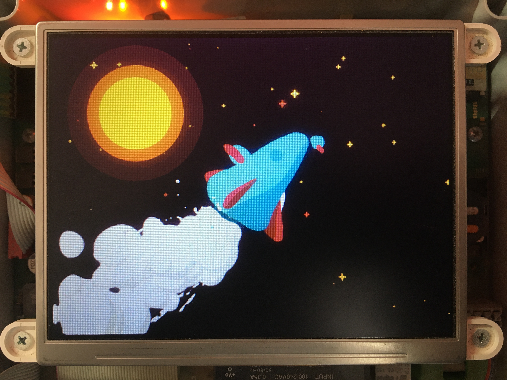

# Framebuffer Animations

Framebuffer Animations is an open-source project designed to play GIF animations on a raw framebuffer device, primarily intended for use in embedded devices. It provides a lightweight and efficient solution for rendering animated content on displays connected to embedded systems.

<p align="center">

</p>

## Features

* Plays GIF animations on raw framebuffer devices,
* Lightweight and suitable for resource-constrained environments,
* The binary has no dependencies,
* Designed for use in embedded systems,
* Customizable for different display configurations,
* Written in Rust for performance and reliability.

## Cross-Compilation

Cross-compiling Framebuffer Animations for your target embedded system is straightforward. Here's an example of cross-compilation for The NXP i.MX28 processor with support for the ARMv5TE instruction set.

1. Install the cross-compiler toolchain for your target.

2. Setup a target for Rust:

```bash
rustup target add armv5te-unknown-linux-gnueabi
```

3. Clone the repository:

```bash
git clone https://github.com/pawelkn/framebuffer-animations.git
```

4. Create a _.cargo_ subfolder in the project directory.

```bash
cd framebuffer-animations
mkdir .cargo
```

5. Edit _.cargo/config_ file. Set the valid _gcc_ cross-compiler for your target. Set additional compiler flags, if needed. Example file content:

```ini
[target.armv5te-unknown-linux-gnueabi]
linker = "/home/pawel/buildroot/output/host/usr/bin/arm-buildroot-linux-gnueabi-gcc"
rustflags = [
  "-C", "link-arg=-Wl,--dynamic-linker=/lib/ld-linux.so.3",
  "-C", "link-arg=--sysroot=/home/pawel/buildroot/output/host/usr/arm-buildroot-linux-gnueabi/sysroot"
]
```

6. Build the project:

```bash
cargo build --target=armv5te-unknown-linux-gnueabi --release
```

## Deployment

Deployment of Framebuffer Animations depends on your specific embedded system and framebuffer device. However, here are some general steps to follow:

1. Transfer the built binary to your embedded device:

```bash
scp target/armv5te-unknown-linux-gnueabi/release/fba root@192.168.10.100:/usr/bin/
```

2. Transfer example images:

```bash
scp -r images root@192.168.10.100:/root/
```

3. Log in to your device via SSH.

```bash
ssh root@192.168.10.100
```

4. Ensure that your framebuffer device exists and is accessible:

```bash
ls -l /dev/fb*
crw-rw----    1 root     root       29,   0 Jan  1  1970 /dev/fb0
```

5. Run the example on your embedded device:

```bash
fba --device /dev/fb0 --interval 5 --once /root/images/spaceship-640x480.gif
```

Enjoy your GIF animations on your embedded display!

<p align="center">

</p>

## Command Line Arguments

The Framebuffer Animations accepts the following command line arguments:

- `--device`, `-d`: Specifies the framebuffer device file. Default is `/dev/fb0`.

- `--interval`, `-i`: Sets the interval step for displaying GIF frames in milliseconds. Default is 5 milliseconds.

- `--once`, `-o`: When provided, the GIF animation will play only one time. By default, it loops indefinitely.

- `gif_file`: The path to the GIF file that you want to play.

## Troubleshooting

If you encounter any issues while using Framebuffer Animations, first check, if the framebuffer is in sleep mode.
To leave Framebuffer sleep power mode:

```bash
echo 0 > /sys/class/graphics/fb0/blank
```

## Image Sources

The example images used in this project are sourced from:

* Spaceship - Kövesházi Dániel - https://dribbble.com/shots/3121924-Spaceship

## Buy Me A Coffee! ☕

If you find the project beneficial and would like to support me, please consider showing your appreciation by buying me a coffee on [Buy Me A Coffee](https://buycoffee.to/pawelkn)
